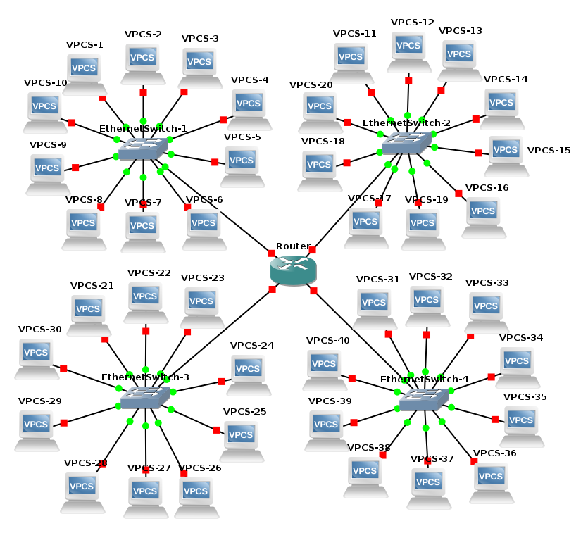

# [Projeto-Teleinformatica-e-Redes-1](https://github.com/jonataasgoomes/Projeto-Teleinformatica-e-Redes-1)
Projeto 1 de Teleinformática e Redes 1 de 2017/2 Universidade de Brasilia

O projeto tem como objetivo implementar no ambiente NS3 quatro LANs Ethernet (padrão 802.3) em uma WAN , em qualquer padrão , interligando todas as LANs.
Cada LAN possue 10 clientes em cada uma das redes Ethernet, em uma das LANs existe um servidor de aplicação que pode ser acessado pelos nós/clientes das outras redes.

  
   
  <t><b>Figura 1</b>: Topologia implementada.</t>
   

### Grupo
* Jônatas Gomes P. Junior  - 14/0146407
  - [X] _Versão do ns-3_:
  - [X] _Sistema Operacional_: Debian GNU/Linux 9 (stretch) 64-bit
* Gabriel Tomazz - 
  - [X] _Versão do ns-3_: 
  - [X] _Sistema Operacional_:
