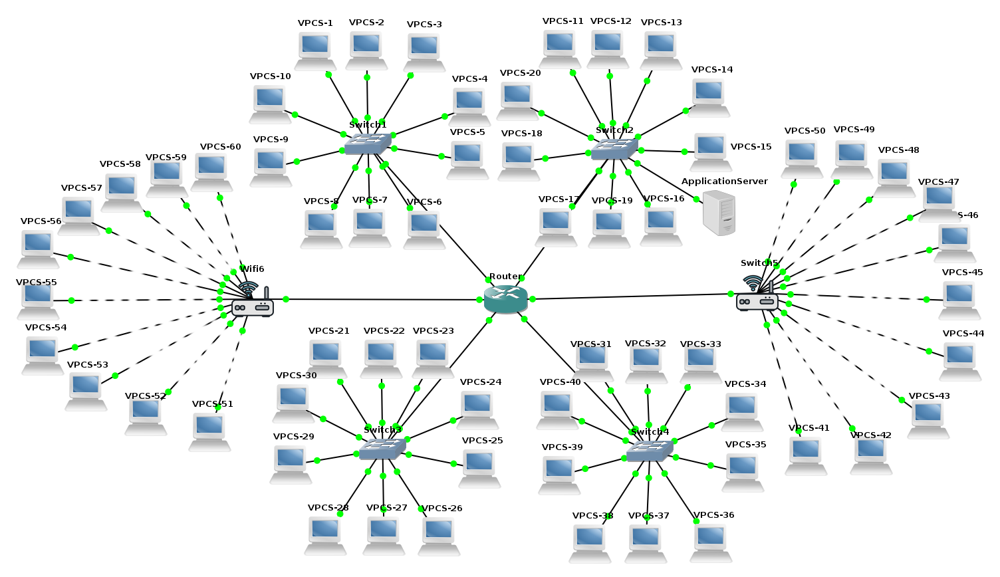

# [Teleinformatica e Redes 1](https://github.com/jonataasgoomes/Projeto-Teleinformatica-e-Redes-1)
###### Universidade de Brasília 2/2017
1.  Implementação de Redes Locais no NS-3 e Análise de Tráfego
    <p>- O projeto tem como objetivo implementar no ambiente NS-3 quatro LANs Ethernet (padrão 802.3), Duas LANs Wi-fi(802.11x) em uma WAN , em qualquer padrão , interligando todas as LANs.</p>
    <p>- Cada LAN tem 10 clientes em cada uma das redes Ethernet, em uma das LANs existe um servidor de aplicação que pode ser acessado pelos nós/clientes das outras redes.</p>

## Pacotes necessários do NS-3 no Linux:
 Para funcionamento do NS-3 sao necessários os pacotes:
 ```
 gcc g++ python,
 python-dev,
 mercurial,
 gdb valgrid,
 tcpdump
 ```
   [Guia de instalação de pacotes](https://www.nsnam.org/wiki/Installation#Prerequisites).

 ## Instalação do NS-3 no linux.

  Baixe todas as dependências necessárias para a instalação use o guia de instalacao de pacotes.
  Crie o diretório ns3 para inserir os arquivos de instalacão:

    mkdir ns3
    cd ns3

  Baixe o NS-3: Download[http://www.nsnam.org/download/](https://www.nsnam.org/ns-3-27/download/)
  <p>Descompacte o arquivo baixado e mude o diretório:</p>

    tar xjf ns-allinone-$release.tar.bz2
    cd ns-allinone-$release/

  Faca o build :

    ./build.py --enable-examples --enable-tests
  Caso não tenha ocorrido nenhum erro, o NS-3 foi instalado com sucesso. Caso você queira testar a ferramenta, o NS-3 possui um script chamado test.py dentro da pasta ns3-$release. Você pode executá-lo pelo seguinte comando:

    cd ns3-$release
    ./test.py -c core

  Caso a saída seja parecida com essa, sem erros...

    PASS: TestSuite lte-frequency-reuse
    240 of 243 tests passed (240 passed, 3 skipped, 0 failed, 0 crashed, 0 valgrind errors)
    List of SKIPped tests:
      ns3-tcp-cwnd
      ns3-tcp-interoperability
      nsc-tcp-loss

  a ferramenta foi instalada com êxito.

## Uso da ferramenta:

    Para executar um script é necessário copiá-lo para a pasta scratch. Depois, execute o waf para compilar o script.

      cp myscript.cc scratch/
      ./waf

    Para executar, basta executar o mesmo comando:

      ./waf --run myscript

<p align="center">
  
  <br>
  <t><b>Figura 1</b>: Topologia implementada.</t>
  <br>
</p>

### Grupo
* Jônatas Gomes P. Junior  - 14/0146407
  - [X] _Versão do ns-3_: ns-3.26
  - [X] _Sistema Operacional_: Debian GNU/Linux 9 (stretch) 64-bit
* Gabriel Tomaz -
  - [X] _Versão do ns-3_:
  - [X] _Sistema Operacional_:
