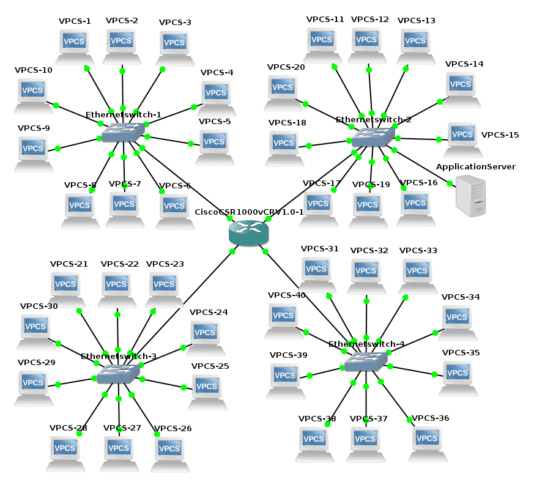

# [Teleinformatica e Redes 1](https://github.com/jonataasgoomes/Projeto-Teleinformatica-e-Redes-1)
###### Universidade de Brasília 2/2017
1.  Implementação de Redes Locais no NS-3 e Análise de Tráfego
    <p>- O projeto tem como objetivo implementar no ambiente NS3 quatro LANs Ethernet (padrão 802.3) em uma WAN , em qualquer padrão , interligando todas as LANs.</p>
    <p>- Cada LAN tem 10 clientes em cada uma das redes Ethernet, em uma das LANs existe um servidor de aplicação que pode ser acessado pelos nós/clientes das outras redes.</p>
    
## Pacotes necessários do NS-3 no Linux:
 Para funcionamento do NS-3 sao necessários os pacotes:
 ```
 gcc g++ python,
 python-dev,
 mercurial,
 gdb valgrid,
 tcpdump
 ```
   [Guia de instalação de pacotes](https://www.nsnam.org/wiki/Installation#Prerequisites).
 
 ## Instalação do NS-3
 1. Download:[http://www.nsnam.org/download/](http://www.nsnam.org/download/)
 2. 

<p align="center">
  
  <br>
  <t><b>Figura 1</b>: Topologia implementada.</t>
  <br>
</p>

### Grupo
* Jônatas Gomes P. Junior  - 14/0146407
  - [X] _Versão do ns-3_:
  - [X] _Sistema Operacional_: Debian GNU/Linux 9 (stretch) 64-bit
* Gabriel Tomaz - 
  - [X] _Versão do ns-3_: 
  - [X] _Sistema Operacional_:
